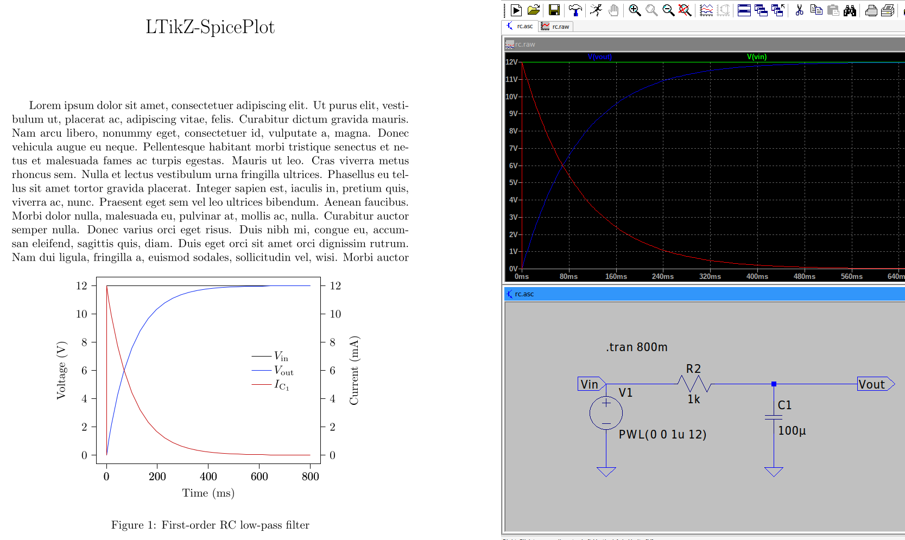

# LTikZ-SpicePlot
  

A bridge between LTspice and Matplotlib/Matplot2TikZ for creating beautiful plots from LTspice simulation data.



## What it is

LTspice is a powerful circuit simulator, but its built-in plotting capabilities are limited and not suitable for publications or presentations. During my bachelor's degree in electrical engineering, I repeatedly wrote Python scripts to visualise LTspice results. These were almost always identical, or I used copies and modified things. So I thought I'd write a little tool instead of repeating myself over and over again.

**LTikZ-SpicePlot** features:

- **Beautiful matplotlib plots** with style presets
- **Multiple input formats**: `.raw` (binary) and `.txt` (exported) LTspice files
- **Direct TikZ export** for seamless LaTeX integration and further customization
- **Dual-axis plots** for voltage and current with independent auto-scaling
- **Easy CLI interface** for quick visualizations

## Installation

```bash
pipx install git+https://github.com/heinzmmo/ltikz-spiceplot.git
```

### Requirements
- Python 3.8+
- TeX Live

## Quick Start

### Command Line Interface

```bash
# Show all available signals in your simulation
ltplot simulation.raw --available

# Plot all signals (opens matplotlib window)
ltplot simulation.raw

# Plot specific signals
ltplot simulation.raw --signals 'V(out)' 'I(R1)'

# Export as PDF
ltplot simulation.raw --output plot.pdf

# Export as TikZ for LaTeX
ltplot simulation.raw --output plot.tex

# Use IEEE style with custom title
ltplot simulation.raw --style ieee --title "Buck Converter Output"
```

## Style Options

### DE Style (European convention)
- Uses ***U*** for voltage
- Format: $U/\mathrm{mV}$, $I/\mathrm{\mu A}$

### IEEE Style (US convention) - default
- Uses ***V*** for voltage
- Format: Voltage ($\mathrm{mV}$), Current ($\mathrm{\mu A}$)

### Black and White Style
- Optimized for black & white printing
- Uses different line styles instead of colors

```bash
ltplot data.raw --style ieee     # Default
ltplot data.raw --style de       # DE style
ltplot data.raw --style ieee_bw  # IEEE black & white
ltplot data.raw --style de_bw    # DE black & white
```

## Examples

Clone the repository to try the examples:

```bash
git clone https://github.com/heinzmmo/ltikz-spiceplot.git
cd ltikz-spiceplot/examples
```

### Example 1: Basic Workflow

```bash
cd rc

# Show all available signals
ltplot rc.raw -a

# Preview the figure in matplotlib window
ltplot rc.raw -s 'V(vout)' 'I(C1)'

# Export figure as PDF
ltplot rc.raw -s 'V(vout)' 'I(C1)' -o example_1.pdf
```

**Important:** Signal names must match exactly as they appear in LTspice. Use `--available` to list all signals.

**Note:** If a net label with the prefix 'V' has been assigned in LTspice (e.g., `Vout`), this will be displayed as `V(vout)`. The tool automatically removes the redundant 'v' and displays it as $U_\mathrm{out}$ (DE style) or $V_\mathrm{out}$ (IEEE style).

### Example 2: TikZ Export

```bash
cd ../opamp

# Show all available signals
ltplot opamp.raw -a

# Export figure as TikZ-Figure
ltplot opamp.raw -s 'V(out)' 'I(R1)' --legend-loc 'lower left' --style de_bw -o example_2.tex

# Compile document
mkdir latex_build
pdflatex -halt-on-error -output-directory latex_build main.tex
```

**LaTeX Integration:**

The `.tex` export creates two files:
1. `my_figure.tex` - The TikZ plot code
2. `ltikz_spiceplot_preamble.tex` - Required LaTeX packages

See `examples/opamp/main.tex` for a complete integration example.

## CLI Reference

```
ltplot [-h] [-a] [-s SIGNAL [SIGNAL ...]] [--legend-loc LOC] [-t TITLE] [--style STYLE] [-o FILE] [--version] filepath

positional arguments:
  filepath              Path to LTspice .raw (binary) or .txt (text export) file

options:
  -h, --help            show this help message and exit
  -a, --available       List all available signal names and exit
  -s SIGNAL [SIGNAL ...], --signals SIGNAL [SIGNAL ...]
                        Signal names to plot (e.g., 'V(out)' 'I(R1)'). Must match LTspice signal names / --available output exactly
  --legend-loc LOC      Legend location: 'best', 'upper right', 'lower left', etc. (default: best)
  -t TITLE, --title TITLE
                        Figure title (optional)
  -g, --grid            Show grid
  --style STYLE         Plot style: 'de' (U/I), 'ieee' (V/I), 'ieee_bw/de_bw' (black & white). Default: ieee
  -o FILE, --output FILE
                        Output filename (.pdf, .tex). If omitted, shows interactive plot
  --version             show program's version number and exit
```

## Status

**Note**: This project is functional. Test coverage still needs to be added. Contributions are welcome!

## Roadmap

- Complete test coverage
- Additional plot styles
- Support for AC analysis plots

## Acknowledgements

- [**LTspice**](https://www.analog.com/en/resources/design-tools-and-calculators/ltspice-simulator.html): Circuit simulator by Analog Devices
- [**spicelib**](https://github.com/nunobrum/spicelib): LTspice `.raw` parser
- [**matplotlib**](https://github.com/matplotlib/matplotlib): Plotting library
- [**matplot2tikz**](https://github.com/ErwindeGelder/matplot2tikz): Converting matplotlib to TikZ

## Support

- **Issues**: [GitHub Issues](https://github.com/heinzmmo/ltikz-spiceplot/issues)
- **Discussions**: [GitHub Discussions](https://github.com/heinzmmo/ltikz-spiceplot/discussions)
